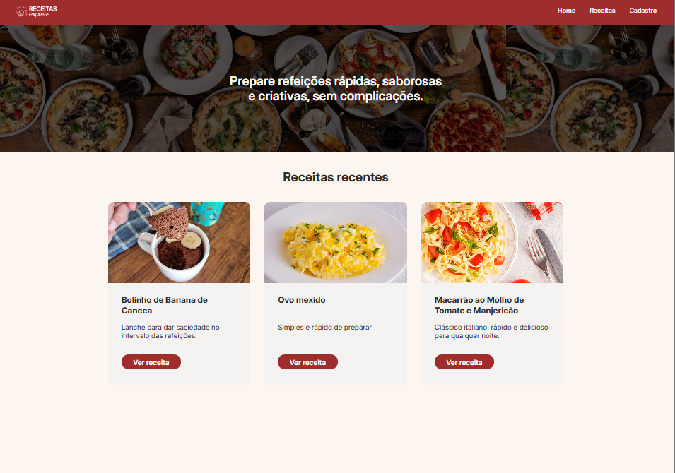
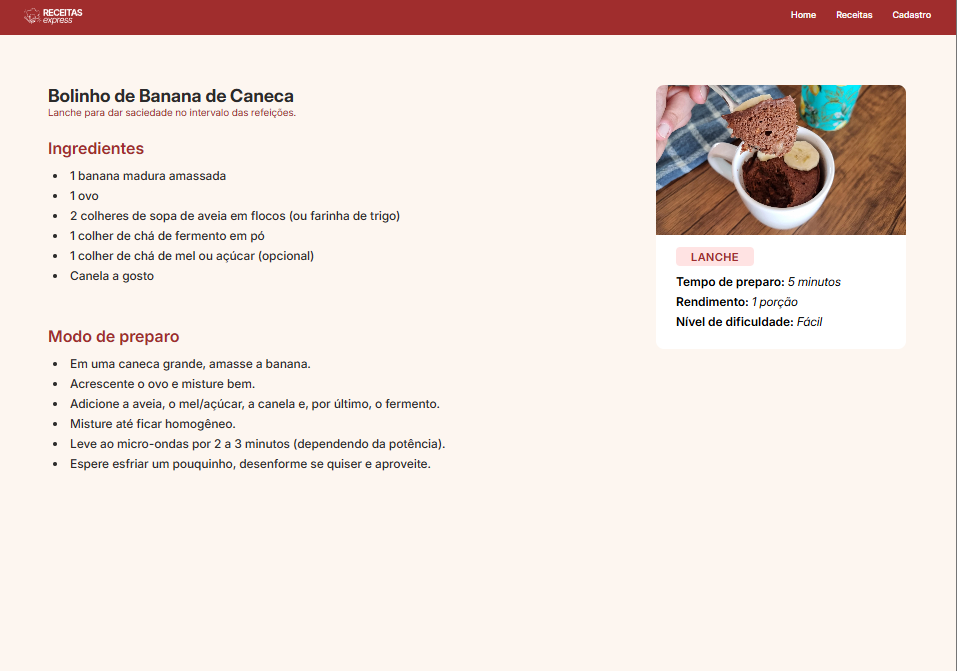
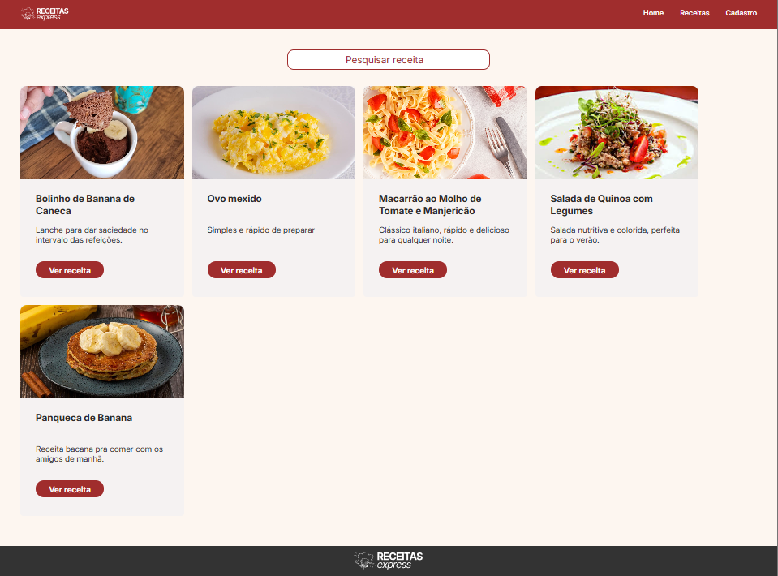
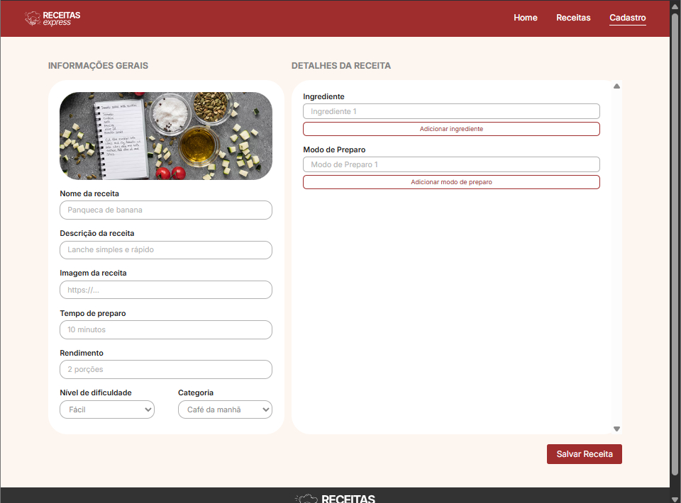

# Nome do Projeto

> Um website para cadastrar, organizar e consultar suas receitas de forma rápida e prática.

## 🔖 Sumário
- [Nome do Projeto](#nome-do-projeto)
  - [🔖 Sumário](#-sumário)
  - [📝 Sobre](#-sobre)
  - [⚡ Funcionalidades](#-funcionalidades)
  - [🛠️ Tecnologias](#️-tecnologias)
  - [🚀 Instalação](#-instalação)
  - [🎯 Uso](#-uso)
  - [📸 Exemplos](#-exemplos)
  - [🗂️ Estrutura do Projeto](#️-estrutura-do-projeto)
  - [📞 Contato](#-contato)

## 📝 Sobre

> Uma aplicação web desenvolvida em ReactJS que facilita o cadastro, listagem e visualização de receitas. Permite filtrar e acessar detalhes de cada receita facilmente.

## ⚡ Funcionalidades
- 📝 Cadastro de receitas com título, ingredientes e modo de preparo
- 📋 Listagem de todas as receitas cadastradas
- 🔍 Filtros por nome
- 📌 Visualização detalhada de cada receita
  
## 🛠️ Tecnologias
Utilizo ReactJS no front para desenvolver as interfaces e interatividade e o JSON Server para simular um backend e armazenar os dados que estão sendo cadastrados.
- **Frontend:** [ReactJS](https://reactjs.org/)
- **Backend:** [JSON Server](https://github.com/typicode/json-server)

## 🚀 Instalação
Passo a passo para rodar o projeto localmente:
```bash
# Clonar o repositório
git clone https://github.com/dayanegcneves/receitas-express.git

# Entrar na pasta do projeto
cd receitas-express

# Instalar dependências
npm install

# Rodar o projeto
npm start
```

## 🎯 Uso

Através de um terminal node, acesse a pasta backend e execute o comando: ```npm run start```

Em seguida, na pasta do projeto execute o comando: ```npm run dev``` e acesse http://localhost:5173/ ou a porta configurada para visualizar o projeto

## 📸 Exemplos

- Página principal: últimas receitas cadastradas


- Detalhes da receita: ingredientes e preparo


- Listagem de todas as rceitas cadastradas:


- Cadastro de receita: formulário para adicionar receitas



## 🗂️ Estrutura do Projeto

Explique a organização do código:

```src/
├─ assets/           # Imagens, ícones e arquivos estáticos
├─ components/       # Componentes reutilizáveis
├─ pages/            # Páginas principais
├─ routes/           # Configurações das rotas
└─ services/         # Chamadas API
```

## 📞 Contato

- LinkedIn: [dayanegcneves](https://www.linkedin.com/in/dayanegcneves/)
- GitHub: [dayanegcneves](https://github.com/dayanegcneves)
